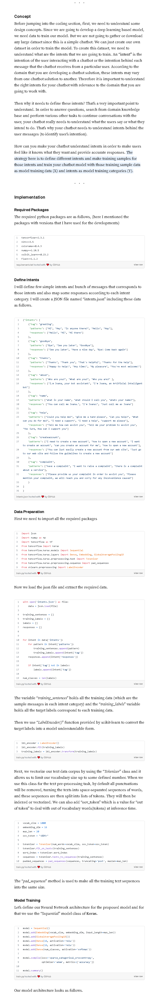

Concept
Before jumping into the coding section, first, we need to understand some design concepts. Since we are going to develop a deep learning based model, we need data to train our model. But we are not going to gather or download any large dataset since this is a simple chatbot. We can just create our own dataset in order to train the model. To create this dataset, we need to understand what are the intents that we are going to train. An “intent” is the intention of the user interacting with a chatbot or the intention behind each message that the chatbot receives from a particular user. According to the domain that you are developing a chatbot solution, these intents may vary from one chatbot solution to another. Therefore it is important to understand the right intents for your chatbot with relevance to the domain that you are going to work with.

Then why it needs to define these intents? That’s a very important point to understand. In order to answer questions, search from domain knowledge base and perform various other tasks to continue conversations with the user, your chatbot really needs to understand what the users say or what they intend to do. That’s why your chatbot needs to understand intents behind the user messages (to identify user’s intention).

How can you make your chatbot understand intents in order to make users feel like it knows what they want and provide accurate responses. The strategy here is to define different intents and make training samples for those intents and train your chatbot model with those training sample data as model training data (X) and intents as model training categories (Y).

Implementation
Required Packages
The required python packages are as follows, (here I mentioned the packages with versions that I have used for the developments)

Define Intents
I will define few simple intents and bunch of messages that corresponds to those intents and also map some responses according to each intent category. I will create a JSON file named “intents.json” including these data as follows.

Data Preparation
First we need to import all the required packages

Now we load the json file and extract the required data.

The variable “training_sentences” holds all the training data (which are the sample messages in each intent category) and the “training_labels” variable holds all the target labels correspond to each training data.

Then we use “LabelEncoder()” function provided by scikit-learn to convert the target labels into a model understandable form.

Next, we vectorize our text data corpus by using the “Tokenizer” class and it allows us to limit our vocabulary size up to some defined number. When we use this class for the text pre-processing task, by default all punctuations will be removed, turning the texts into space-separated sequences of words, and these sequences are then split into lists of tokens. They will then be indexed or vectorized. We can also add “oov_token” which is a value for “out of token” to deal with out of vocabulary words(tokens) at inference time.

The “pad_sequences” method is used to make all the training text sequences into the same size.

Model Training
Let’s define our Neural Network architecture for the proposed model and for that we use the “Sequential” model class of Keras.

Our model architecture looks as follows.

Now we are ready to train our model. Simply we can call the “fit” method with training data and labels.

After training, it is better to save all the required files in order to use it at the inference time. So that we save the trained model, fitted tokenizer object and fitted label encoder object.

Inference
Okay!!!! now it’s time to check how our model performs. 😊

We are going to implement a chat function to engage with a real user. When a new user message is received, the chatbot will calculate the similarity between the new text sequence and training data. Considering the confidence scores got for each category, it categorizes the user message to an intent with the highest confidence score.

You can see that it’s working perfectly!!!

Integration With Chat Applications
Also, you can integrate your trained chatbot model with any other chat application in order to make it more effective to deal with real world users.

I have already developed an application using flask and integrated this trained chatbot model with that application.

The final solution looks like this,

Final Thoughts
We discussed how to develop a chatbot model using deep learning from scratch and how we can use it to engage with real users. With these steps, anyone can implement their own chatbot relevant to any domain.

As further improvements you can try different tasks to enhance performance and features.

Use more data to train: You can add more data to the training dataset. A large dataset with a good number of intents can lead to making a powerful chatbot solution.
Apply different NLP techniques: You can add more NLP solutions to your chatbot solution like NER (Named Entity Recognition) in order to add more features to your chatbot. With having a NER model along with your chatbot, you can easily find out any entity that appeared in user chat messages and use it for further conversations. And also you can add a Sentiment Analysis model to identify different sentiment tones behind user messages and it will exactly give some additional colors to your chatbot.
Try different neural network architectures: You can also try different neural network architectures with different hyperparameters.
Add emojis: You can also consider emojis when building your models.
You can find the source codes for this article from the Github repository.

Hope you enjoyed this article and stay tuned for another interesting article. Also, I’ll be happy to hear your feedback.