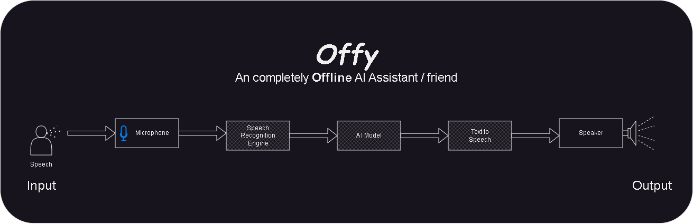

## Overview

The main idea behind this project was to create an oflline software which will be like a friendly chatbot to talk with and which will also be able to do the basic tasks on PC through Speech interaction.This is using noraml Machine Learnign technology as of now, but i have to use **GPT** technology in this project.

It uses 2 ML models.
The main features of this  project : 
1. **Offline** : It is completely offline to use on your personal computers, so it ensures privacy; and hence also improving the speed compared to using API services. Only to search on internet it will need internet connectivity.
2. **Continuous** : This Chatbot will work contineously till you stop it. Unlike other Voice assistants, you dont have to call its name again and again to use it, so its almost like talking to a real human friend.
3. **Assistant** : So it is not just only chatbot, but also can use to do basic automation tasks on pc like opening application etc. And can also will able to search the content on internet and present the result in an interesting format.


## Architecture
The project is comprised of mainly three subprojects or technologies :

1. **Speech Recognition** : This is a component used to convert speech to text. The Speech collected from a person is captured using microphone and the converted text is sent to the next component AI Bot. This component is build using the prebuilt project by [vosk](https://github.com/alphacep/vosk-api). I have used final built model here, the main project is [Here](https://github.com/tu2-atmanand/Speech_Recognition).

2. **AI Bot** : This is the main brain of the whole project. This is built using Machine Learning. Here i have used the  final built model, the main project is [Here](https://github.com/tu2-atmanand/Offy-Brain).

3. **Text To Speech** : This component is used to convert the output of the AI into speech. You can read the documentation and todo of this project [Here](https://github.com/tu2-atmanand/Text_To_Speech).


I have used Divide and Concure Approach here so that i can built the whole final product efficiently. I have  broke this main project as subprojects, which you can follow to by clicking the respective links. The two are itself big projects so i kept them seperate and using only their final build ML models in this project direclty in this.


## How to Run
- Install Python 3.8
- Install all the Requirement modules and any other recommended modules : ``` pip install -r Requirements.txt ```
- Run the main.py file : ``` python main.py ```


## TODO
- Integrate Assistant functionalities to do the basic task.
- Create an GUI, to see the input output and also use controls easily.


## Future Ideas

- Improving the AI, to remember past conversation and react accordingly.
